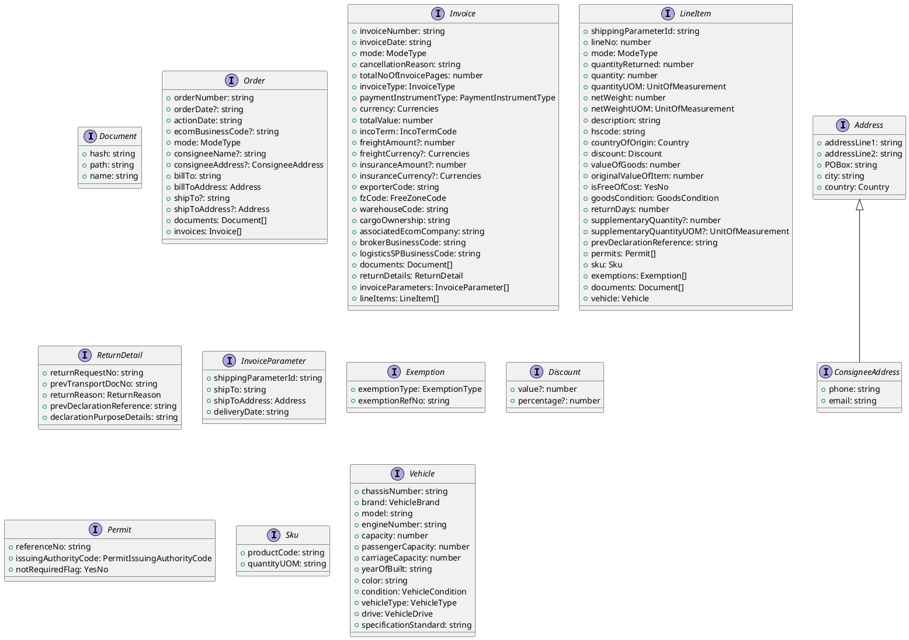
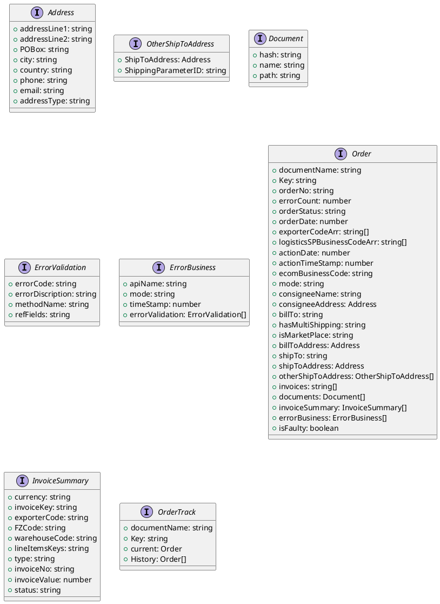
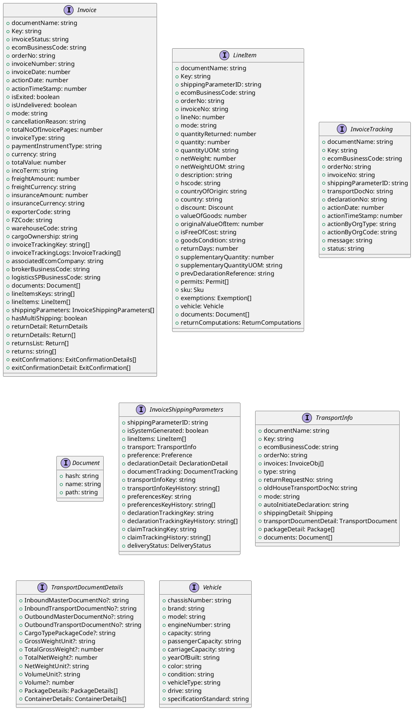

# DHL Duty Drawback Data Models

## Submit Order

```puml
@startuml

interface Document {
    +hash: string
    +path: string
    +name: string
}
interface Address {
    +addressLine1: string
    +addressLine2: string
    +POBox: string
    +city: string
    +country: Country
}
interface ConsigneeAddress extends Address {
    +phone: string
    +email: string
}
interface Order {
    +orderNumber: string
    +orderDate?: string
    +actionDate: string
    +ecomBusinessCode?: string
    +mode: ModeType
    +consigneeName?: string
    +consigneeAddress?: ConsigneeAddress
    +billTo: string
    +billToAddress: Address
    +shipTo?: string
    +shipToAddress?: Address
    +documents: Document[]
    +invoices: Invoice[]
}
interface Invoice {
    +invoiceNumber: string
    +invoiceDate: string
    +mode: ModeType
    +cancellationReason: string
    +totalNoOfInvoicePages: number
    +invoiceType: InvoiceType
    +paymentInstrumentType: PaymentInstrumentType
    +currency: Currencies
    +totalValue: number
    +incoTerm: IncoTermCode
    +freightAmount?: number
    +freightCurrency?: Currencies
    +insuranceAmount?: number
    +insuranceCurrency?: Currencies
    +exporterCode: string
    +fzCode: FreeZoneCode
    +warehouseCode: string
    +cargoOwnership: string
    +associatedEcomCompany: string
    +brokerBusinessCode: string
    +logisticsSPBusinessCode: string
    +documents: Document[]
    +returnDetails: ReturnDetail
    +invoiceParameters: InvoiceParameter[]
    +lineItems: LineItem[]
}
interface LineItem {
    +shippingParameterId: string
    +lineNo: number
    +mode: ModeType
    +quantityReturned: number
    +quantity: number
    +quantityUOM: UnitOfMeasurement
    +netWeight: number
    +netWeightUOM: UnitOfMeasurement
    +description: string
    +hscode: string
    +countryOfOrigin: Country
    +discount: Discount
    +valueOfGoods: number
    +originalValueOfItem: number
    +isFreeOfCost: YesNo
    +goodsCondition: GoodsCondition
    +returnDays: number
    +supplementaryQuantity?: number
    +supplementaryQuantityUOM?: UnitOfMeasurement
    +prevDeclarationReference: string
    +permits: Permit[]
    +sku: Sku
    +exemptions: Exemption[]
    +documents: Document[]
    +vehicle: Vehicle
}
interface ReturnDetail {
    +returnRequestNo: string
    +prevTransportDocNo: string
    +returnReason: ReturnReason
    +prevDeclarationReference: string
    +declarationPurposeDetails: string
}
interface InvoiceParameter {
    +shippingParameterId: string
    +shipTo: string
    +shipToAddress: Address
    +deliveryDate: string
}
interface Exemption {
    +exemptionType: ExemptionType
    +exemptionRefNo: string
}
interface Discount {
    +value?: number
    +percentage?: number
}
interface Permit {
    +referenceNo: string
    +issuingAuthorityCode: PermitIssuingAuthorityCode
    +notRequiredFlag: YesNo
}
interface Sku {
    +productCode: string
    +quantityUOM: string
}
interface Vehicle {
    +chassisNumber: string
    +brand: VehicleBrand
    +model: string
    +engineNumber: string
    +capacity: number
    +passengerCapacity: number
    +carriageCapacity: number
    +yearOfBuilt: string
    +color: string
    +condition: VehicleCondition
    +vehicleType: VehicleType
    +drive: VehicleDrive
    +specificationStandard: string
}
@enduml
```

## HyperLedger BlockChain Models

### Smart Contract Order

```puml
@startuml
interface Address {
    +addressLine1: string
    +addressLine2: string
    +POBox: string
    +city: string
    +country: string
    +phone: string
    +email: string
    +addressType: string
}
interface OtherShipToAddress {
    +ShipToAddress: Address
    +ShippingParameterID: string
}
interface Document {
    +hash: string
    +name: string
    +path: string
}
interface ErrorValidation {
    +errorCode: string
    +errorDiscription: string
    +methodName: string
    +refFields: string
}
interface ErrorBusiness {
    +apiName: string
    +mode: string
    +timeStamp: number
    +errorValidation: ErrorValidation[]
}
interface Order {
    +documentName: string
    +Key: string
    +orderNo: string
    +errorCount: number
    +orderStatus: string
    +orderDate: number
    +exporterCodeArr: string[]
    +logisticsSPBusinessCodeArr: string[]
    +actionDate: number
    +actionTimeStamp: number
    +ecomBusinessCode: string
    +mode: string
    +consigneeName: string
    +consigneeAddress: Address
    +billTo: string
    +hasMultiShipping: string
    +isMarketPlace: string
    +billToAddress: Address
    +shipTo: string
    +shipToAddress: Address
    +otherShipToAddress: OtherShipToAddress[]
    +invoices: string[]
    +documents: Document[]
    +invoiceSummary: InvoiceSummary[]
    +errorBusiness: ErrorBusiness[]
    +isFaulty: boolean
}
interface InvoiceSummary {
    +currency: string
    +invoiceKey: string
    +exporterCode: string
    +FZCode: string
    +warehouseCode: string
    +lineItemsKeys: string
    +type: string
    +invoiceNo: string
    +invoiceValue: number
    +status: string
}
interface OrderTrack {
    +documentName: string
    +Key: string
    +current: Order
    +History: Order[]
}
@enduml
```

### Smart Contract Invoice

(not all)

```puml
@startuml
interface Invoice {
    +documentName: string
    +Key: string
    +invoiceStatus: string
    +ecomBusinessCode: string
    +orderNo: string
    +invoiceNumber: string
    +invoiceDate: number
    +actionDate: number
    +actionTimeStamp: number
    +isExited: boolean
    +isUndelivered: boolean
    +mode: string
    +cancellationReason: string
    +totalNoOfInvoicePages: number
    +invoiceType: string
    +paymentInstrumentType: string
    +currency: string
    +totalValue: number
    +incoTerm: string
    +freightAmount: number
    +freightCurrency: string
    +insuranceAmount: number
    +insuranceCurrency: string
    +exporterCode: string
    +FZCode: string
    +warehouseCode: string
    +cargoOwnership: string
    +invoiceTrackingKey: string[]
    +invoiceTrackingLogs: InvoiceTracking[]
    +associatedEcomCompany: string
    +brokerBusinessCode: string
    +logisticsSPBusinessCode: string
    +documents: Document[]
    +lineItemsKeys: string[]
    +lineItems: LineItem[]
    +shippingParameters: InvoiceShippingParameters[]
    +hasMultiShipping: boolean
    +returnDetail: ReturnDetails
    +returnDetails: Return[]
    +returnsList: Return[]
    +returns: string[]
    +exitConfirmations: ExitConfirmationDetails[]
    +exitConfirmationDetail: ExitConfirmation[]
}
interface LineItem {
    +documentName: string
    +Key: string
    +shippingParameterID: string
    +ecomBusinessCode: string
    +orderNo: string
    +invoiceNo: string
    +lineNo: number
    +mode: string
    +quantityReturned: number
    +quantity: number
    +quantityUOM: string
    +netWeight: number
    +netWeightUOM: string
    +description: string
    +hscode: string
    +countryOfOrigin: string
    +country: string
    +discount: Discount
    +valueOfGoods: number
    +originalValueOfItem: number
    +isFreeOfCost: string
    +goodsCondition: string
    +returnDays: number
    +supplementaryQuantity: number
    +supplementaryQuantityUOM: string
    +prevDeclarationReference: string
    +permits: Permit[]
    +sku: Sku
    +exemptions: Exemption[]
    +vehicle: Vehicle
    +documents: Document[]
    +returnComputations: ReturnComputations
}
interface InvoiceTracking {
    +documentName: string
    +Key: string
    +ecomBusinessCode: string
    +orderNo: string
    +invoiceNo: string
    +shippingParameterID: string
    +transportDocNo: string
    +declarationNo: string
    +actionDate: number
    +actionTimeStamp: number
    +actionByOrgType: string
    +actionByOrgCode: string
    +message: string
    +status: string
}
interface Document {
    +hash: string
    +name: string
    +path: string
}
interface InvoiceShippingParameters {
    +shippingParameterID: string
    +isSystemGenerated: boolean
    +lineItems: LineItem[]
    +transport: TransportInfo
    +preference: Preference
    +declarationDetail: DeclarationDetail
    +documentTracking: DocumentTracking
    +transportInfoKey: string
    +transportInfoKeyHistory: string[]
    +preferencesKey: string
    +preferencesKeyHistory: string[]
    +declarationTrackingKey: string
    +declarationTrackingKeyHistory: string[]
    +claimTrackingKey: string
    +claimTrackingHistory: string[]
    +deliveryStatus: DeliveryStatus
}
interface TransportInfo {
    +documentName: string
    +Key: string
    +ecomBusinessCode: string
    +orderNo: string
    +invoices: InvoiceObj[]
    +type: string
    +returnRequestNo: string
    +oldHouseTransportDocNo: string
    +mode: string
    +autoInitiateDeclaration: string
    +shippingDetail: Shipping
    +transportDocumentDetail: TransportDocument
    +packageDetail: Package[]
    +documents: Document[]
}
interface TransportDocumentDetails {
    +InboundMasterDocumentNo?: string
    +InboundTransportDocumentNo?: string
    +OutboundMasterDocumentNo?: string
    +OutboundTransportDocumentNo?: string
    +CargoTypePackageCode?: string
    +GrossWeightUnit?: string
    +TotalGrossWeight?: number
    +TotalNetWeight?: number
    +NetWeightUnit?: string
    +VolumeUnit?: string
    +Volume?: number
    +PackageDetails: PackageDetails[]
    +ContainerDetails: ContainerDetails[]
}
interface Vehicle {
    +chassisNumber: string
    +brand: string
    +model: string
    +engineNumber: string
    +capacity: string
    +passengerCapacity: string
    +carriageCapacity: string
    +yearOfBuilt: string
    +color: string
    +condition: string
    +vehicleType: string
    +drive: string
    +specificationStandard: string
}
@enduml
```
