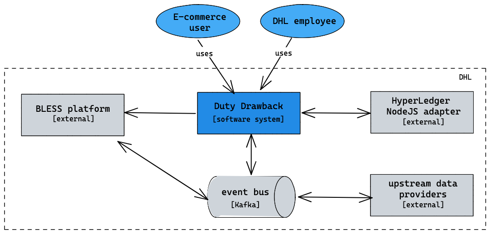
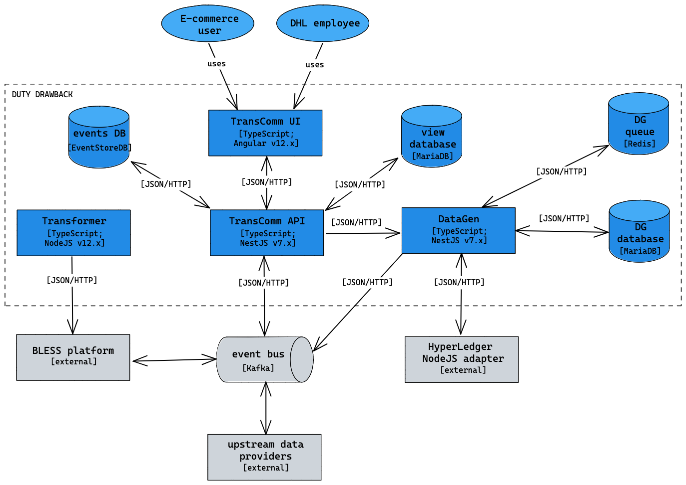
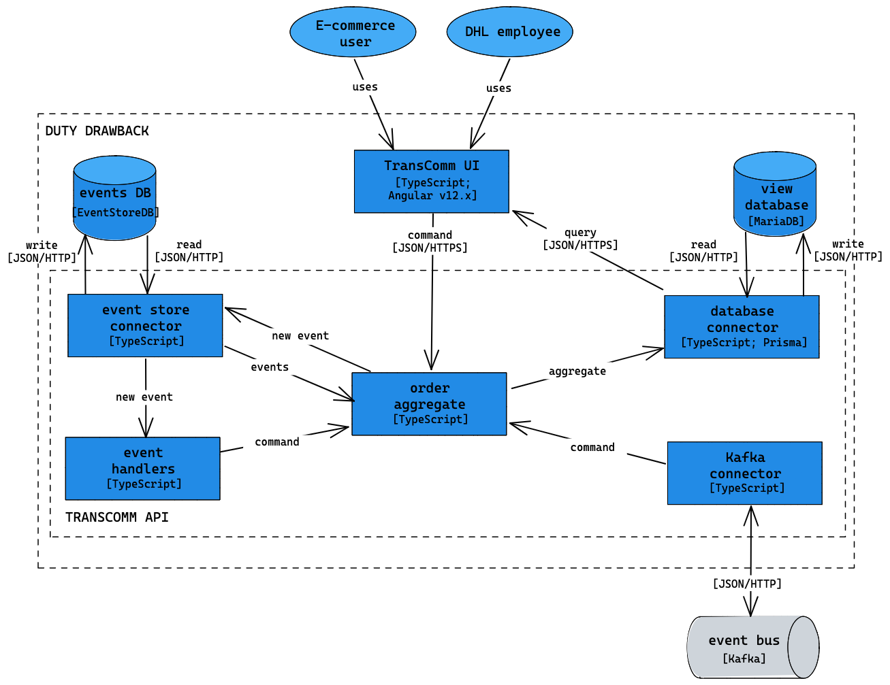

# Design documentation

> Throughout this design document, architectural diagrams are visualized using the [C4 model](https://c4model.com).  

## Solution overview

The Duty Drawback System will process specific orders from DHL clients and register that the order data in the DHL Bless Platform. The order will then be registered in a Hyperledger. Any status changes will be synced. The core systems at play are:

- **BLESS platform**: The Bless Platform is a core component within the DHL system landscape, it exposes various communication APIs allowing for systems to communicate.
- **HyperLedger NodeJS adapter**: the HyperLedger (HL) holds all smart contracts of DHL in a blockchain. The duty drawback system does not communicate directly with the HL, but communicates with an exposed NodeJS adapter application. 
- **Kafka**: most commutation between the duty drawback system, and the BLESS platform will happen via the DHL Kafka instance. 

## Business drivers
One of the digital challenges in DHL Dubai’s daily operations is processing orders submitted by E- commerce parties which go through customs. The process gets more complex when taking returns into account. Stakeholders such as the government and E-Commerce parties must be kept up to date with the status and details of orders, and DHL employees must be able to swiftly resolve errors in the process. 
The current duty drawback system is lacking in critical functions, such as, but not limited to: 

* Fields are limited on invoice and item level 
* There is no support for FZ and CW codes 
* Logistics, declaration and last mile delivery processors aren’t treated as separate entities 
* FFSTATs files are required and HAWB and shipping information are kept separately 
* Declarations are submitted by the courier company and only validated by the smart contract 
* Support for declaration types are restricted 
* Failed declaration submissions cannot be amended, instead couriers must submit a new one 
* No support for goods exit confirmations and NR claims 
* Only the courier confirms return deliveries 

## Technical architecture

- **TransComm UI**: the client application accessible for all DHL employees and e-commerce users. It shows information coming from the TransComm API and allows 
- **TransComm API**: primary application of the system responsible for the majority of business logic, user management, and authentication server for the TransComm UI. The primary architectural pattern behind this application is event sourcing.
- **DataGen**: responsible to handle all communication with the HL, including filtering of all incoming topics from the HL, to ensure only those topics relevant for TransComm are processed. To process all incoming messages, a Redis in-memory data store is used. This allows the DataGen to rate limit all incoming messages, and ensure no message gets lost, as each message complying with the criteria required querying the HL as well.
- **Transformer**: validates payloads against a JSON schema. Originally intended to be an exposed API gateway that e-commerce clients can use for validation. However, decision is made by DHL to not make it exposed externally. 

### Event sourcing & CQRS
The core architectural principles of the ‘TransComm API’ are [Event Sourcing](https://martinfowler.com/eaaDev/EventSourcing.html#:~:text=The%20fundamental%20idea%20of%20Event,as%20the%20application%20state%20itself.)) and [CQRS](https://martinfowler.com/bliki/CQRS.html). This approach allows for a scalable, maintainable and robust setup towards the future. 

The below diagram is a ‘Dynamic diagram’ according to the C4 modeling rules. It only shows parts of the internal working of the ‘TransComm API’ application, and only shows relevant containers of the overall system. 

1. The UI, Kafka or event handlers, can invoke ‘commands’ around orders. These commands are handled by the ‘order aggregate’. 
2. The ‘order aggregate’ retrieves all events (via the ‘event store connector’) related to the order (if existing). It replays the events to get the current state of the order. One or more new events (depending on the command) is added on top of the current state of the order, to create a potential future state of the order. 
3. The potential future state of the order is validated. If the state is valid, the new event or events are send to the ‘event store connector’. This component is responsible to write the event in the event store. In addition, it pings the ‘event handler’ of the new event(s). The event handler can optionally invoke a new command. 
4. Once the new events are stored in the event store, the ‘order aggregate’ sends the new state of the order, as an aggregate, to the ‘database connector’. The new state of the order is stored here. 
5. Whenever the UI requests data, i.e. queries data, the request is send to the ‘database connector’. This means all data shown in the UI is coming from the view database.

The described approach has several advantages in the Duty Drawback system. 

- The event store acts as the ‘single-source of truth’ for all orders in the system. Each change to an ‘order’ is stored as an event. Combining all events and replaying them allows to recreate the current state of an order. 
- Allows to show the history of an order, if this becomes a requirement in the future. 
- Separation of concerns between the single-source of truth (event store) and the current state of orders (view database).
- Changing requirements can never impact existing events. They can only allow for new types of events. As all events related to a single order will persist, new structures in the view database can be created by replaying the events. This allows for major migrations without loosing data. 
- By utilizing [Prisma.io](https://www.prisma.io/), minor migrations in the database can be automated, even in a production setting. 

A potential downside of event sourcing is a performance hit, when there are a lot of events that need to be replayed to get the current state of an object. However, current requirements do not state such scenarios (around a maximum of 20 events need to be replayed). If this becomes an issue in the future, implementing snapshots that are stored in the event store is the known way to mitigate the issue. 

### Constraints & assumptions
- The solution has to be build using NodeJS and Angular, as per requested by DHL. 
- The solution cannot use MongoDB as a database technology, because of its license, as per requested by DHL. 
- The environments are setup and maintained by DHL, Finaps creates the CI/CD pipelines.
- DHL provides all necessary restrictions around security. It will provide the JWT token for authentication with the BLESS platform, and for the HL NodeJS adapter, a JWT token per e-commerce party is provided by DHL. 
- Initial scope of the application is DHL Dubai, with an average of 200 transactions per day. Architecture should be able to scale to a few million transactions per week, as indicated by DHL on 13-08-2021.
- No email, browser or text message notifications will be provided. 

## API Description
### Reference documentation
Below is a list of the documentation received from DHL that is used to design the integrations with other systems, and design the exposed API from the ‘Transformer’ container.

- **DC_DHL_Courier_ReleaseII_APIDocumentation_0.7.docx**: document used to design the exposed API (for external e-commerce parties) of the ‘Transformer’ container of the technical architecture. API is current *not* in use. 
- **PDD_Ecom_Logistics_R1_API V0.9.6 DHL 30Jun2021.pdf**: document used for the communication/integration with Dubai customers and more information used around smart contracts (HyperLedger). 
- **HLF-Gateway-APP_OpenAPI3.0-Specifications.pdf**: document describing the adapter application on top of the HyperLedger. Used as a reference to design the interaction between the ‘DataGen’ and the ‘HyperLedger NodeJS adapter’.
- **BLESS-3 Application Interface Specification v1.1.pdf**: reference document around the BLESS specifications.  

### Sequence diagrams around interactions with other systems

The diagram above highlights the system interaction when a new order enters the system. Data enters the Bless Platform from the transformer and all other systems are made aware. Both the TransComm and the DataGen act accordingly when this message is received. 

The HyperLedger will emit events when data in the ledger has changed, when this occurs it is our understanding that the DataGen will consume these events and publish them to the appropriate Kafka topic. This will notifiy subscribes of the change, in this case, the Bless and TransComm components. 

When orders require adjustment, DHL users must do this using the TransComm component. When a change is invoked, the request will be sent to the DataGen, which will in turn submit the request to the HyperLedgerAdapter. 

### Kafka topics
- **BLESS -> TransComm: ’New Order’**:  When e-commerce party submits an order via the api, the bless platform notifies us via this topic.
- **BLESS -> TransComm: ’Notification’**: when ever we receive a message from bless, we should expect that there will be a follow up message to notify that the other systems have processed it, this is particularly important with the submit order. If an order is submitted and this message is not received, it will not move forward in its business cycle.
- **BLESS/Shipment module -> TransComm: ’NewPickupFile’**: When the oder is physically picked up, this message is consumed by our system, this event is required as part of the criteria to submit events to the hyperledger. If a new order, notification of process and pickup file are received, the order can be submitted to the blockchain 
- **BLESS/Shipment module -> TransComm: ’NewMasterMovementFile’**: The first movement file, this file contains the master movement Id which is later used to link other movement files to the existing orders. The link is established via Order’s OrderNumber linked to the Pickup File’s AirwayBillNo which can be found within the master movement file. 
- **BLESS/Shipment module -> TransComm: ’NewDetailMovementFile’**: Orders are linked via the process mentioned above, with the addition of linking the master movement file id to this file. Once both a master and detail movement is received shipping info can be added to the blockchain 
- **TransComm -> BLESS: ’BlessAckTopic’**: Acknowledgement that event has been processed successfully
- **DataGen -> BLESS & BLESS -> TransComm: ’HyperLegderEvents’**: DataGen consumes events regarding blockchain activities, if an event relates to an order within our system, datagen notifies the system via this topic.

## Data storage & data model
Below an overview of the data model of the event store for the ’TransComm API’.
- `id: string`
- `eventAggregate: string`
- `eventName: string`
- `data: json`
- `metaData: string`
- `type: string`
- `blessId: string`

Below the data model of the view database for the ‘TransComm API’. 
.png)

Below the data model of the ‘DataGen’ database.
.png)

## Deployment
### Services
* DataGen
* DataTransformer
* TransCommBackend
* TransCommUI
* Redis
* EventStore

### Repository
Main development is done in Azure DevOps repositories, hosted on the Finaps directory and license. We leverage the Azure pipeline service to mirror our Azure DevOps to the DHL hosted BitBucket repository.

### Environment
* All service containers are built using **Docker**.
* Deployment is done with **Docker Compose**. Deployment instructions can be found in the project’s repository in the documentation folder.

## Non-functional requirements
### Security
- JWT tokens will be used for all authentication. The JWT tokens will be send in the header of the outgoing requests. 
- DHL will provide a JWT token for the authentication of the ‘Transformer’ to the ‘BLESS platform’.
- DHL will provide a JWT token for each e-commerce party for the authentication of requests between the ‘DataGen’ and ‘HyperLedger NodeJS adapter’.
- Kafka is hosted within the same network as the ‘TransComm API’ and ‘DataGen’, no additional security is required here. 

In addition, the following security measures are taken:

	- SonarQube is used for additional security scans.
	- Users are automatically logged out after 24 hours.
	- The JWT access token is valid for 1 hour, while the JWT refresh token is valid for 24 hours. 

### Performance and scalability
Several measures and checks are implemented to achieve a sensible performance within the ‘TransComm API’. 

- All data for get requests coming from the Angular client application is paginated.
- Each action invoked by a user has at most one read and one write database transaction. 
- All write-related actions are performed within the scope of a single transaction (in the business context). Such a transaction has at most around 20 related entities. Therefor, data transformations only happens on a very limited set. 
- The Angular client application uses minimum state management to cache data retrieved within a single session, to reduce the amount of requests to the ‘TransComm API’. 

The above results in relative high performance within the ‘TransComm API’. Assuming a well performing database, and internal network within a production-like setup, no action should take more than an average of 100ms within the ‘TransComm API’. Under assumption of reasonable database performance and network stability of the user, user actions should not take more than an average of 500ms, while get requests should have an average lower than 300ms.

The corner stone of this design is event sourcing. The main concern within event sourcing is performance issues around large event logs that need to be replayed to get the current state of an object. Current NFRs indicate that this will not be a problem from the ‘TransComm API’. Each transaction is limited to a low number of events. Event sourcing itself scales very well with a high volume of transactions. It can easily handle millions of transactions per second if must be. The scalability is, therefor, limited by the production environment setup.

In addition to the architectural pattern of event sourcing, the ‘DataGen’ uses an in-memory data store (Redis). The Kafka bus follows a ‘fire-and-forget’ principle. However, the DataGen has to processes incoming messages (complying to several criteria) and query the HL for each these incoming message. To ensure none of the incoming messages from the Kafka bus get lost, they are stored in the Redis cache.

### Reliability, availability & maintainability
A unit-/functional-test coverage of at least 70% is set as the minimal threshold by Finaps for all code that is written. In additional, DHL is responsible to perform UAT and integration tests. DHL is responsible for the final sign-off of all user stories and the entire solution, as per the contract. Lastly, as explained in the technical architecture, event sourcing allows for zero data loss around database migrations, mutations of data, etc. 

The availability of the solution depends on the availability provided by the setup production environment, which falls outside the responsibilities of Finaps, and within the responsibilities of DHL. 

The solution follows common design patterns and best practices, as outlined by the [NestJS](https://docs.nestjs.com/) and [Angular](https://angular.io/docs) documentation. In addition, TypeScript is chosen as the language for both the front-end and back-end application, to improve the readability and maintainability of the application. In addition, [SonarQube](https://www.sonarqube.org/) scans are used for code quality and security checks. Lastly, because it builds upon event sourcing, the ‘view database’ can be remodeled by replaying all events for each entity, and remodel the result into a different structure. This allows for easier adaption to data changes. 

### Localization, portability & compatibility
No localization is implemented. On a request basis, new localization option can be added 1 by 1. 

The application can be deployed on any environment running Node >X.X. In addition, it can be accessed via any modern browser, as highlighted in the next paragraph. As event sourcing is used, the data cannot easily be transferred directly. However, the application State at any point in past time can be rehydrated and derived. These states of the data can be transferred.

As Angular version 12.0.4 is used, the solution is accessible for all end-users running a modern browser. However, the focus is on the desktop experience. This means no optimizations are made for mobile browsers, i.e. no responsiveness and optimization for touch. The detailed list of browser compatibility, as per the documentation of [Angular](https://angular.io/guide/browser-support), can be found below. 

	- Chrome: latest
	- Firefox: latest + ESR
	- Edge & Safari (macOS): 2 most recent major versions
	- Internet Explorer 11: deprecated