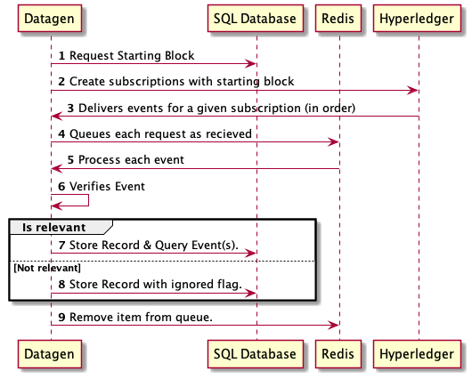
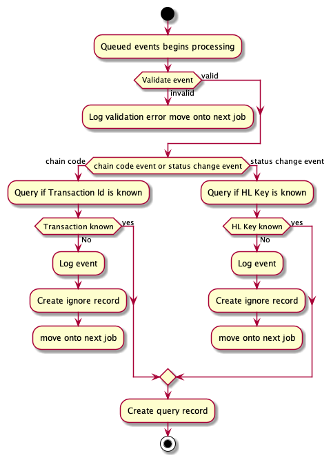

# Event Record Data Design

```javascript
model HyperledgerEvent {
  id            String      @id @default(uuid())
  createdAt     DateTime    @default(now())
  updatedAt     DateTime    @updatedAt
  status        EventStatus
  key           String
  collection    String
  blockNumber   Int
  orderNumber   String
  invoiceNumber String?
  ecomCode      String
  eventName     String
}
```

|Field   | Description  |
|---|---|
|Id   | unique identifier  |
|createdAt | Auto time stamp of when created|
|updatedAt| Auto time stamp of when updated|
|status| A status to reflect in which state the record sits, possible values include: OPEN, PROCESSING, COMPLETE and IGNORE|
|key|The key from hyperledger used to query|
|collection|The collection the event belongs to|
|blockNumber| The Hyperledger block number for that event, this value is not unique to one event|
|orderNumber| The order number for a given event|
|invoiceNumber| If relevant, the invoice number for a given event, this important for methods such as submit return|
|ecomCode| The e-commerce code for a given order|
|eventName| This reflects the possible contract event names, possible values include: CLAIM_STATUS, DECLARATION_STATUS and chainCode|

## Records use whilst subscribing to Hyperledger

The following query is performed at startup:

```sql
SELECT a1.${eventName}, MAX(${blockNumber}) AS 'highestBlockNumber'
FROM
(
  SELECT ${eventName}, MAX(${blockNumber}) AS 'highestBlockNumber'
  FROM HyperledgerEvent AS a
  GROUP BY ${eventName}
) a1
JOIN HyperledgerEvent AS b
ON b.${eventName} = a1.${eventName}
AND b.${blockNumber} != a1.highestBlockNumber
GROUP BY a1.${eventName}
```

The result of this query returns the following data structure:

```javascript 
[
  {
    eventName: "Chain", 
    highestBlock: 4
  }, 
  {
    eventName: "Declaration", 
    highestBlock: 2
  }
]
```

Per subscription we determine the starting block is the second highest known block number.
This is done to ensure we haven't missed any events within any of the known blocks.

## Subscription sequence
This figure gives an overview as to how the subscription are created.



## Processing Queue

This figure gives an overview as to how the queue processes the events:

